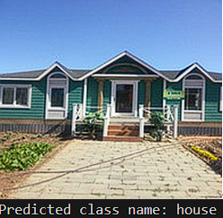
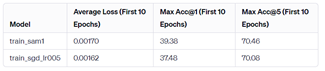

# MoCoViT-PyTorch-CIFAR-SAM

## 介绍
本项目是在资源受限的情况下，在移动设备部署轻量级CNN+ViT网络，并且将其用于图像分类任务，进一步探索和优化的尝试
项目使用了MoCoViT网络，采用CIFAR100数据集，SAM优化器，不断调整各种参数来寻求较好的效果
**本项目仅作为个人学习神经网络的记录**

## 实验环境
实验要求PyTorch 1.0+，此外所需软件包整理为requirements.txt
```
argparse
distutils
torch
torchvision
PIL
scikit-optimize
```
运行以下命令即可安装:
```
pip install -r requirements.txt
```


## 数据集下载
本次实验使用torchvision包中的datasets模块来下载CIFAR100数据集，运行训练代train.py即可下载到```./data```目录下

## 运行方式
首先通过```cd```命令进入项目根目录，然后运行训练和测试脚本

### Train
通过```python train.py```命令运行训练脚本，如果想要指定参数请你参考以下用法

```
usage: train.py [-h] [--imagenet_path IMAGENET_PATH] [--gpu GPU] [--epochs EPOCHS] [--validate {True,False}]
                [--train_batch TRAIN_BATCH] [--val_batch VAL_BATCH] [--num_workers NUM_WORKERS]


```

### Test
通过```python test.py```命令运行测试脚本，如果想要指定参数请你参考以下用法
```
usage: test.py [-h] [--imagenet_path IMAGENET_PATH] [--gpu GPU] [--epoch EPOCH] [--num_workers NUM_WORKERS]
               [--verbose {True,False}]

```
**注意：** 请你根据具体情况修改以下部分
```model.load_state_dict(torch.load('checkpoints/epoch.pt'))  # 模型文件路径，保存在checkpoints目录下```
```image_path = 'image.jpeg'  # 要分类的图像路径```

## 实验结果


